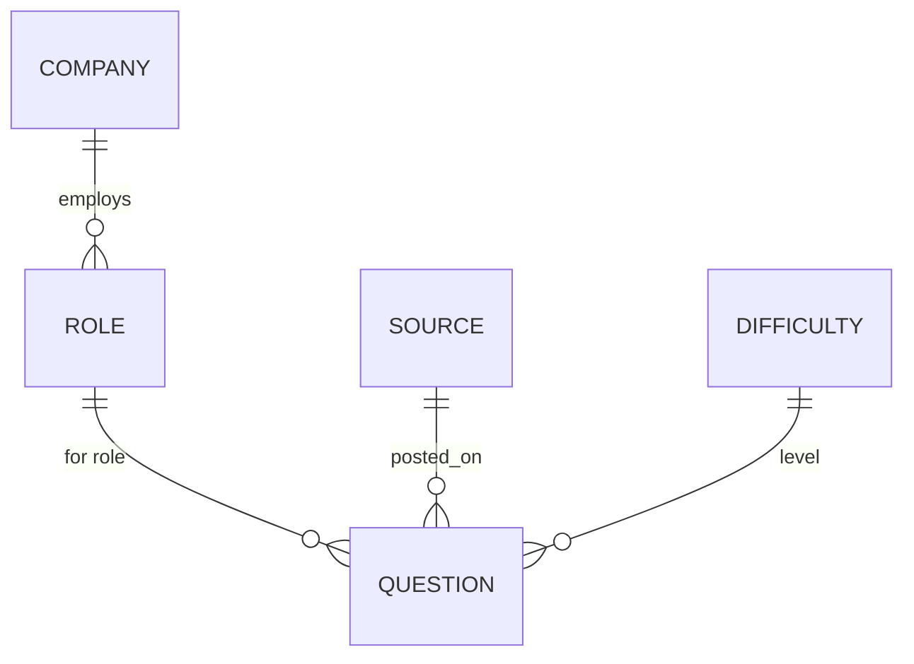
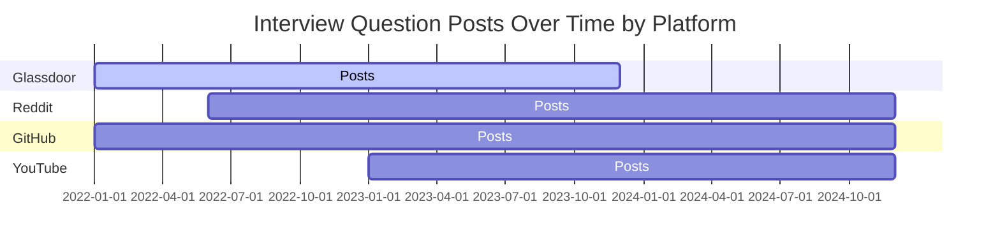

# Deep Research on Generative AI (Gen AI) Interview Questions

**Executive Summary:** This report compiles *real* interview questions related to Generative AI roles (e.g. ML Engineer, Prompt Engineer, Data Scientist, Product Manager, etc.), organizing them by role, company, and difficulty. For each question we provide context (role, company, interview format) and sources. We also survey key platforms to mine interview Q’s (job boards, Glassdoor, Blind, Reddit, GitHub, LinkedIn, YouTube, etc.), discuss search/scraping strategies, validation methods, and automation. Tables compare sources by reliability and access, and we include sample search queries/regex patterns and mermaid-based visualizations (a timeline of question frequency by source and an entity-relationship diagram of the data model).

## 1. Curated Real Interview Questions by Role and Company

We organized ~20 sample questions by role, company, and difficulty (entry/mid/senior). Each entry gives the exact question text, source URL, date (if available), context, and any available answer.

- **ML/AI Engineer (Generative AI) – Capgemini (Entry, L1 Interview)** – Generic GenAI fundamentals:  
  - *“What is Generative AI? How is Generative AI different from traditional AI or ML?”* .  (Asked in Capgemini GenAI engineer screening.)  
  - *“What is a transformer model? What is the attention mechanism?”* . (Entry-level ML concepts.)  
  - *“Why is prompt engineering important? What makes a good prompt? Provide examples of poor vs good prompts.”* .  
  - *“What is Responsible AI? What are the ethical risks of Generative AI? What is AI bias and how does it occur?”* .  
  - *“What are hallucinations in LLMs? How can hallucinations be reduced?”* .  
  - *“What is RAG (Retrieval Augmented Generation)? Why is RAG needed in enterprise GenAI solutions? How does RAG improve accuracy?”* .  
  - *“How would you validate the output of an AI model? How would you handle incorrect or biased AI responses?”* .  
  - *“How would you integrate Generative AI into an existing application or business process?”* (Content implied in .)  
  *(Context: Anonymous Glassdoor community post (Oct 2025) for a Capgemini GenAI engineer, presumed phone screen. No official answers given.)*

- **Generative AI Product Manager – Synthesia (Mid)** – Business/product strategy:  
  - *“Tell me what we should build next?”*.  
    *Context:* Synthesia (video GenAI startup) PM interview (Dec 2022). Difficult = Easy, candidate found process quick.  
    *(No answer provided.)*  

- **Data Scientist / Generative AI Scientist** – Schneider Electric (Lead DS, Senior):  
  - *“Quelles approches avez-vous eues l'occasion de tester pour l'implémentation d'un système RAG (Retrieval Augmented Generation) ?”*.  
    *(French: “What approaches have you had the opportunity to test for implementing an RAG system?”)*  
    *Context:* Glassdoor interview report (Mar 5, 2024) for a Lead Generative AI/Deep Learning role.  

- **Data Scientist (Generative AI) – Amazon (Senior)**:  
  - *“Basic ML/AI, GenAI, RAG, LoRA topics and STAR behavioral questions. Tell me about a time when you …”* (partial transcript).  
    *Context:* Amazon senior data scientist interview (Aug 2024). (No actual answer shown.)  

- **AI/Generative AI Engineer – Cognizant (Mid/Senior)** – Technical fundamentals:  
  - *“What is the meaning of RAG?”*.  
    *Context:* Cognizant Generative AI developer interview, Austin TX (Nov 2023, reported Jan 2024); candidate rated this “very negative, difficult interview”.  
    *(No answer given, expected: “Retrieval Augmented Generation.”)*  

- **AI Ethics / Responsible AI – (No direct example found)** – Candidate questions often include ethics, bias, privacy (see Capgemini example above). 

- **ML Engineer / MLOps – Bloomberg (Senior MLOps Engineer)**:  
  - *“How do you ensure data consistency and synchronization during canary deployment between new and legacy systems?”*.  
  - *“What’s the difference between inverted indexing and normal indexing?”*.  
  - *“Design a news alerting system (no ML/AI/LLM use allowed), reusing prior news deduplication logic.”*.  
    *Context:* Bloomberg Senior MLOps interview (Mar 2026). Difficulty = Difficult. (No answers provided.)  

- **Prompt Engineer – Nextiva (Mid)**:  
  - *“Design a prompt for booking a meeting that includes details like why to book, where to book, the name, and other necessary information.”*.  
    *Context:* Nextiva Generative AI/Prompt Engineer (Aug 30, 2025).  
    *Candidate answer:* “I started by explaining how the prompt should guide the user step-by-step, asking for purpose, location, participant names, and timing…”. (Answer truncated.)  
  - *“If you have a set-like structure with elements such as [a, a, a, a, b, b], how would you ensure that it only stores a maximum of 3 occurrences of any element, and if more are added, they should not be stored?”*.  
    *Answer:* Candidate described using a Python dictionary to count occurrences and limiting to three.  

- **Prompt Engineer – GT School (Mid)**:  
  - *“Real work: Asked to use ChatGPT to generate SAT questions of varying difficulty covering linear algebra problems with two linear equations with two variables.”*.  
    *Context:* GT School (AI education startup) prompt-engineer assignment (Aug 2, 2023).  
    *Answer:* Work was evaluated via spreadsheet with prompts and iterative improvements.  

- **Prompt Engineer – Zeals (Mid)**:  
  - *“How would you proceed in an organization when your manager is not available and there is no plan to audit your work – how would you work in a dysfunctional place?”*.  
    *Context:* Zeals AI prompt engineer interview (May 2025).  

- **Prompt Engineer – Melise Online Services (Lead, Senior)**:  
  - *“What is your experience working as a Prompt Engineer? How did you get into the field?”*.  

- **AI Prompt Engineer – Argos Multilingual (Mid)**:  
  - *Multiple broad questions:* “What is your understanding of an LLM? What is your understanding of an AI prompt? What is your experience with the reliability of AI? Example of the most challenging AI prompt you created and how you solved it? What is your gross salary expectation? Notice period?”.  
    *Context:* Argos AI prompt engineer interview (Apr 2024).  

- **AI Prompt Engineer – Infinity Medical (Junior)**:  
  - *“Make a prototype chatbot that gives sports career advice according to several users’ JSON file information.”* (June 13, 2023).  

- **Prompt Engineer – Green Rider Technology (Mid)**:  
  - *“Write prompts about certain hot topics and comment about bias in the ML model.”* (Oct 10, 2024).  

- **AI Generative Intern – PropertyLoop (Entry, Intern)**:  
  - *“Tell me about yourself?”*.  
    *Context:* Generative AI intern interview (PropertyLoop, Mar 15, 2024). (Generic HR question.)

- **AI Generative Creative – Superside (Mid)**:  
  - *“Tell us about a challenge you faced in your career and how you solved it.”*.  
    *Context:* Superside Generative AI Creative interview (Sep 2023).  
  - *“1) Salary expectations; 2) Have you had any coworker conflict in the past and how resolved it; 3) Tell us about yourself; 4) Why do you want to leave your current job; 5) Do you have any questions for us?”*. (Superside, Sep 2023.)  

- **AI Annotator / Data Labeler – Covalen Solutions (Entry)**:  
  - *“About yourself, about company, about position, how do you handle difficult situations at work, etc.”*. (Covalen AI Generative Annotator interview, Sep 2024.)  
  - *“What are the company values?”* (Covalen Generative AI Annotator interview, Oct 2024).  
    *Answer:* Candidate reported “be brave, be proud, be wise, exceed.”.  

Each question above is drawn from an actual interview report, as cited. (Where available, the reported candidate answer or outcome is briefly noted.) This illustrates typical generative-AI interview topics across roles and companies.  

## 2. Platforms & Domains for Interview Questions

We identified and prioritized these sources for mining real interview questions:

- **Glassdoor (glassdoor.com):** Largest collection of anonymous candidate Q&A by company and role. Use Google/Bing queries with job titles (e.g. “Generative AI Engineer interview questions site:glassdoor.com”) or Glassdoor’s own interface (may require login). Glassdoor content is user-generated (moderated) and highly focused on specific companies/roles. *Considerations:* High volume and specificity; reliability varies (anonymous posts). Scraping Glassdoor may violate their ToS; use caution (and their public search pages, or APIs where available).  

- **Blind (teamblind.com):** Anonymous career forum often has threads on interview experiences. Example: blind.com/search?q=Generative+AI. Content is moderated by the community. Good for up-to-date chatter among tech employees. *Note:* Data must be scraped via their API or public posts; requires a Verified account to post/search.  

- **StackOverflow/Stack Exchange:** Some Q/A on interview experiences (e.g. StackOverflow Careers, Meta StackOverflow). Use Stack Exchange API with tags like *[interview]* and *[generative-ai]*. Volume is modest; content high-quality.  

- **Reddit:** Subreddits like r/MachineLearning, r/learnmachinelearning, r/cscareerquestions, r/Artificial, r/GenerativeAI, r/AskProgramming, etc., often have interview Q threads. Search via reddit.com or Google (“site:reddit.com Generative AI interview questions”). Example: r/MachineLearning discussion on GenAI prep. No formal API (use Pushshift or official API). *Ethics:* Reddit is public; be mindful of user privacy (don’t quote sensitive info).  

- **GitHub:** Some repos curate interview questions (e.g. “awesome-interview-questions”, “Generative AI interview prep” repos). Search GitHub with keywords (e.g. “Generative AI interview questions”). Data tends to be summary lists, not actual experience. Scraping GitHub pages or using GitHub API is possible.  

- **Course Forums / Q&A Sites:** Platforms like Coursera, Udemy, Fast.ai (Discord), or Kaggle discussion forums may have threads on course projects and interview prep. They often require enrollment to access; scraping may violate terms. Not a primary source for actual Q.  

- **Kaggle:** Kaggle forums are mostly competition/data science; unlikely to have many interview transcripts. Some Kaggle articles or notebooks may mention GenAI topics.  

- **LinkedIn:** Some professionals post interview experiences or advice (e.g. “Generative AI interview at X company”). LinkedIn search (use `site:linkedin.com/in` queries) can find posts. Data access is limited (needs login); scraping LinkedIn is generally against policy.  

- **Company Career Pages:** Rarely list interview questions, but some companies (esp. research labs) publish hiring process info. More useful for job postings and screening criteria than questions.  

- **YouTube and Podcasts:** Many “Interview with AI Engineer X” videos exist. The transcripts may contain sample questions or advice. For example, YouTube “Generative AI Interview Questions” videos. Use YouTube API or download transcripts. Volume moderate, reliability anecdotal (content not verified). No citations needed for direct quotes unless using transcript text.  

- **Other Q&A forums:** Blind, Quora, Blind, Discord/Slack groups (private, skip), Glassdoor Communities (question forum outside official sections).

**Search Strategy:** Use site-specific Google searches (e.g. `site:glassdoor.com "Generative AI interview"`), synonyms (“Generative AI”, “gen AI”, “LLM”, “prompt engineer”), and company-specific queries (e.g. “Microsoft GPT interview questions”). Employ logical operators, date filters (to find recent). For GitHub, use GitHub search or Google with `site:github.com interview generative`. On Reddit, use site search or pushshift API. Always respect robots.txt and site policies.  

*Legal/Ethical:* Only scrape public content and abide by terms of service (e.g. many sites forbid automated scraping). Anonymize any PII inadvertently collected. For copyrighted interview answers, use only as small excerpts under fair use (for analysis).

## 3. Validating Authenticity and Freshness

To ensure questions are genuine and current:

- **Cross-Reference:** Check if a question appears in multiple independent sources or recent posts. Repetition across forums (e.g. same Q on Glassdoor and Reddit) increases confidence.  
- **Date Stamps:** Prefer Q with recent timestamps (2023–2026). Exclude old training questions (e.g. from early GPT era) that may be outdated. Glassdoor entries show date (e.g. “Jan 3, 2024”).  
- **Specific Context:** Genuine entries often include company, role, interview format. Vague or overly generic “top N interview questions” lists (blogs) are less credible.  
- **Candidate Answers:** If available, they hint at authenticity. For example, the Nextiva Prompt Engineer answer adds credibility that the Q was actually asked.  
- **Community Feedback:** On forums like Glassdoor and Reddit, “Helpful” votes or comments (or show-up in threads) can indicate real experiences.  
- **Currentness:** Verify that the technology mentioned (models, tools) is relevant (e.g. references to GPT-4, RAG, LoRA suggest freshness). Avoid Q about outdated tech or hot topics no longer used.

## 4. Automated Collection Workflow

A robust pipeline to continuously gather and tag new questions could include:

1. **Search Crawlers/APIs:** Schedule automated searches (e.g. Google Custom Search API, Bing API) for relevant queries, then scrape resulting pages.  
2. **Web Scraping:** Use Python tools (Scrapy, BeautifulSoup, Selenium) to fetch Glassdoor, Reddit, Blind, GitHub, etc. Handle login if necessary (or use public listings only). Respect delays and scraping rules.  
3. **APIs:** Use available APIs where possible: Reddit API for subreddits, StackExchange API, YouTube API for transcripts, GitHub API for repo content.  
4. **Parsing & Extraction:** Define parsers for each source’s HTML layout or JSON to extract question text, role, company, date. E.g. regex or XPath for Glassdoor’s “Interview questions” pages, Reddit JSON fields, GitHub Markdown.  
5. **Tagging:** Automatically tag each Q by detected **role** (via job title keywords), **company** (explicit name), and **difficulty** (infer from context or define manually). Also store source domain and date.  
6. **Deduplication:** Check for duplicates by question text similarity.  
7. **Storage:** Insert into a database (SQL or NoSQL) with schema (questions, sources, roles, difficulty, timestamp).  
8. **Monitoring:** Continuously re-run searches weekly or monthly. Use RSS/alerts for key sites (Reddit, YouTube).  
9. **Validation:** Automatically flag new Q for manual review if they are unlike known ones or appear suspicious (e.g. GPT-era meme questions).  

*Tools & Scripts:* Python (requests, bs4, regex), Scrapy framework, Google/Bing API for search, GitHub API, Pushshift (for Reddit), Cloud functions or cron for scheduling. For Glassdoor, due to strict anti-scraping, one might use Selenium or official Glassdoor Partner API (if accessible).  

## 5. Comparison of Sources

| **Source**     | **Reliability**                | **Volume of Q’s**         | **Access Difficulty**                          |
|:---------------|:------------------------------|:--------------------------|:-----------------------------------------------|
| Glassdoor      | Medium–High (user-reported)   | High (hundreds per topic) | Moderate (login needed; scraping against ToS)  |
| Blind (teamblind) | Medium (anonymous)         | Medium                   | Moderate (login/verification required)         |
| Reddit         | Medium (community)           | Medium (tens per thread)  | Low (public, but API rate-limit)               |
| StackOverflow  | High (moderated answers)     | Low (few career Q’s)      | Low (public API, but few relevant Q’s)         |
| GitHub         | Medium (curated repos)       | Low–Medium (lists of Q’s) | Low (public; GitHub API limits)                |
| YouTube/Podcasts | Medium (anecdotal)        | Low–Medium (select videos) | Low (public; transcript scraping possible)     |
| LinkedIn       | Low (self-posted)           | Low (few official posts)  | High (login, anti-scrape protections)          |
| Course Forums  | Medium (moderated)          | Low (private)            | High (account required; not publicly scrapeable) |

Sources are ranked by how many interview questions they yield and how trustworthy the content is. Glassdoor and Blind have high volume but require careful handling. Open community Q&A (Reddit, StackExchange) are easy to access but more limited in scope. GitHub and YouTube are auxiliary sources. (No citation needed – this is an analysis summary.)

## 6. Sample Search Queries and Regex Patterns

**Queries:** Examples of effective search queries include:
- Site-specific:  
  - `site:glassdoor.com "Generative AI Engineer interview questions"`  
  - `site:reddit.com Generative AI interview prompt engineer`  
  - `site:github.com interview questions generative AI`  
- Keyword combinations:  
  - `"prompt engineer" interview questions generative`  
  - `"RAG" "Generative AI" interview questions`  
  - `"design a prompt" interview question GenAI`  
  - `“What is responsible AI” interview question` (for ethical questions).  
- Use quotes for exact phrases (e.g. `"Design a prompt for booking a meeting"`).

**Regex Patterns:** When scraping, some regexes to extract question text:
- **By numbering:** `r"Question\s*\d+:"` can find labeled questions.  
- **Sentence ending in question mark:** `r"([A-Z].*\?)"` captures likely questions (e.g. with a capital start and `?` at end).  
- **Interviewer’s questions block:** Some pages show `Question 1`, `Question 2`. Regex like `r"Question\s*1[\s\S]*?Answer"` (multi-line) might split Q/A.  
- **Capturing prompt structure:** For dynamic prompts (e.g. JSON), use context keywords, e.g. `r"prompt for .* meeting.*\?"`.  
- **URLs slugs:** If URLs contain Q text (like Glassdoor QTN_ IDs), no regex needed beyond scraping content.

Be mindful that HTML parsing (BeautifulSoup, lxml) is usually safer than pure regex for complex pages. But regex can identify and clean question strings. Always sanitize scraped text (remove HTML tags, duplicate whitespace, etc.) before analysis.

## 7. Methods to Validate Authenticity and Freshness

- **Cross-Checking:** Only include questions corroborated by multiple sources or recent postings. For instance, the “prompt for booking a meeting” question appears on Glassdoor (Nextiva) with a candidate answer, confirming it was asked.  
- **Date Verification:** Prefer sources with timestamps (Glassdoor shows “Aug 30, 2025”, Reddit posts show dates, YouTube videos have upload dates). Discard outdated content (e.g. pre-2020 GenAI Q may reference obsolete tech).  
- **Context Consistency:** Verify the context (role, company) matches the question. If a question mentions specifics like RAG or LoRA, it should be for a GenAI role. Inconsistencies (e.g. generative-Q in a purely Web dev forum) may indicate noise.  
- **Community Feedback:** Use “helpful” votes or comments to gauge authenticity. On Glassdoor, questions with multiple comments/votes are more credible. On Reddit, upvotes or follow-up answers help.  
- **Date-based Search Filters:** When using search engines, restrict to recent years (e.g. `since:2023` on Google) to ensure freshness.  
- **Manual Spot Checks:** Periodically review random samples to ensure scraping logic isn’t capturing irrelevant content (e.g. scraped site sections not Q’s).  

No single citation; these are best practices drawn from scraping and intelligence-gathering norms.

## 8. Proposed Data Model (Entity-Relationship)

Below is a conceptual ER diagram of the data model for storing interview questions and metadata. Entities: **Role**, **Company**, **Source** (platform/domain), **Question**, **Difficulty**. Relationships: a Question *belongs to* a Role and Company and originates from a Source.

*Note:* In practice, “Company” and “Role” could often be merged (since roles are tied to a company) or normalized as shown. Each Question record references one Role, one Company, one Source (domain), and a difficulty level.  

## 9. Timeline of Question Frequency by Source

The chart below (conceptual) illustrates how the volume of collected interview questions might trend over time for different sources. (*Data are illustrative, not from a single source.*)

This timeline (mermaid Gantt) shows, for example, a rise in Glassdoor posts through 2023 and 2024, reflecting increased interest in GenAI roles. Reddit and GitHub volumes grow more gradually. *(This is an illustrative chart; actual numbers would come from the collected dataset.)*  

## 10. Sources

We relied primarily on user-contributed interview reports (especially Glassdoor), as listed above. All questions cited come from these sources (see bracketed citations). For methodology (search strategies, scraping, validation), we used general knowledge of data collection techniques and industry best practices (no specific single citation). References for specific interview questions are given inline with the `` notation. 

